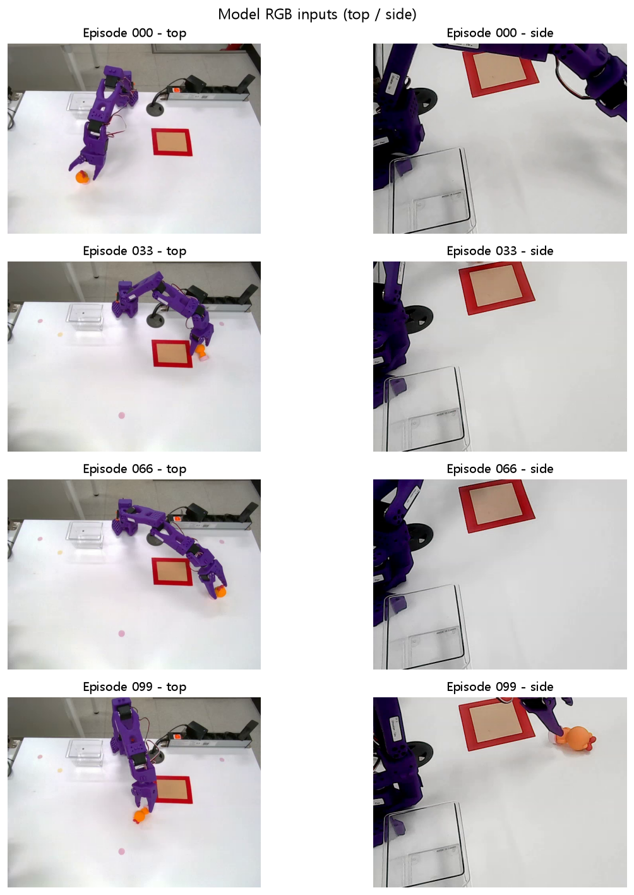
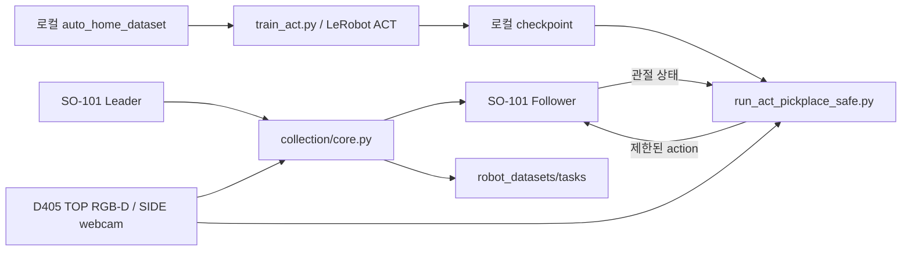

# SO-101 ACT Pick & Place

SO-101 로봇팔의 시연을 RGB-D 데이터로 수집하고, top/side RGB와 관절 상태로 ACT 정책을 학습·실행하는 작업 기록.



## 지금 들어 있는 것

`collection/`은 여섯 작업을 선택하는 Tkinter 수집 창이다. Leader를 조작하면 Follower가 따라 움직이고, HOME에서 벗어나 작업한 뒤 돌아온 시연을 자동 저장한다. 인형 Pick & Place는 별도 ACT 학습·검증·실행 코드와 보고서로 남겼다.

- 인형·종이컵 집기, 분류, 상자 2·3·4개 쌓기를 작업 문장과 함께 수집한다.
- TOP RGB/depth, SIDE RGB, 관절 상태와 action을 LeRobot 데이터셋으로 기록한다.
- HOME 복귀 2초와 최소 녹화 8초 조건을 적용한다. 실패한 시연은 폐기하고 같은 번호로 재시도한다.
- 저장 전후 영상·프레임·메타데이터를 검사하고 중단된 저장을 복구한다. 장비 설정이나 보정값이 달라지면 이어 쓰지 않는다.
- ACT 실행기는 action chunk를 백그라운드에서 갱신하면서 관절 명령에 범위·이동량·추적 오차 제한을 적용한다.

## 수집과 정책 실행



현재 학습기는 기존 `auto_home_dataset` 경로를 사용한다. 새 수집 창의 작업별 데이터가 학습기에 자동 연결되는 구조는 아니다. ACT 입력에서는 depth를 제외하고 top/side RGB와 6차원 관절 상태를 사용한다. [상세 pipeline](docs/PIPELINE.md)에 저장·재개·추론 흐름을 정리했다.

## 장비와 환경

| 역할 | 구성 |
|---|---|
| 로봇 | SO-101 Leader/Follower, Feetech bus |
| 카메라 | RealSense D405 TOP, OpenCV SIDE webcam |
| 학습 | LeRobot ACT, PyTorch, ResNet-18 |
| 영상·데이터 | FFmpeg, TorchCodec, NumPy, LeRobot dataset |
| 수집 화면 | Tkinter, OpenCV, Python subprocess/thread |

Windows Python 3.12 개발환경을 기준으로 작성했다. LeRobot editable 설치, GPU 환경, FFmpeg DLL 설정은 [환경 기록](notes/environment.md)과 [SO-101 운영 명령](notes/so101_run_commands.md)을 확인한다. 공식 LeRobot checkout, 가상환경, 녹화 데이터와 checkpoint는 `.gitignore`로 제외되어 있어 clone만으로 학습·실행을 재현할 수 없다.

## 시작 지점

저장소 루트에서 프로젝트 가상환경이 준비된 상태로 실행한다.

```powershell
.\.venv\Scripts\python.exe .\collection\collect.py
```

장비 연결은 창의 **수집 시작**에서 수행한다. 실제 포트·카메라·HOME 기준은 `collection/settings.json`과 로봇별 보정 파일을 먼저 확인한다. 자세한 조작은 [수집 안내](collection/README.md)에 있다.

```powershell
.\.venv\Scripts\python.exe .\episode_sample_dataset\doll_pickplace_act\train_act.py --steps 20000 --batch-size 4
.\.venv\Scripts\python.exe .\episode_sample_dataset\doll_pickplace_act\run_act_pickplace_safe.py --preflight-only
```

사전점검도 로컬 데이터·checkpoint·패키지가 필요하다. 로봇을 연결하지 않는 옵션이며 실제 모터 실행과 구분한다. [ACT 안내](episode_sample_dataset/doll_pickplace_act/README.md)에 SPACE/P/Q/E 조작과 정지 동작이 있다. HOME 복귀와 토크 해제 방식은 종료 원인에 따라 다르다.

## 코드와 실험 기록

| 위치 | 읽을 내용 |
|---|---|
| `collection/` | 수집 GUI, 검사·복구 engine, 작업/장비 설정, 테스트 |
| `episode_sample_dataset/` | 초기 수동·자동 수집과 ACT 샘플 |
| `robot_calibration/` | 저장된 Leader/Follower 보정값 |
| `scripts/` | 환경·카메라 검사 |
| `notes/doll_pickplace_act_testreport/` | 학습, 모델 평가, 실제 실행 분석 |

[학습 기록](notes/doll_pickplace_act_testreport/01_model_training.md)은 100개 시연·20,000 step 실행을 기록한다. 수치와 그래프는 해당 실험의 기록이다. [평가](notes/doll_pickplace_act_testreport/02_model_evaluation.md)와 [실행 분석](notes/doll_pickplace_act_testreport/03_execution_analysis.md)을 함께 읽어 오프라인 예측과 실제 작업 결과를 구분한다.

수집 테스트는 `collection/tests/`에 있으며 장비 연동 검사는 별도로 구분되어 있다. SmolVLA·Isaac·GR00T 구현이나 REST API 서버는 이 저장소에 없다.
