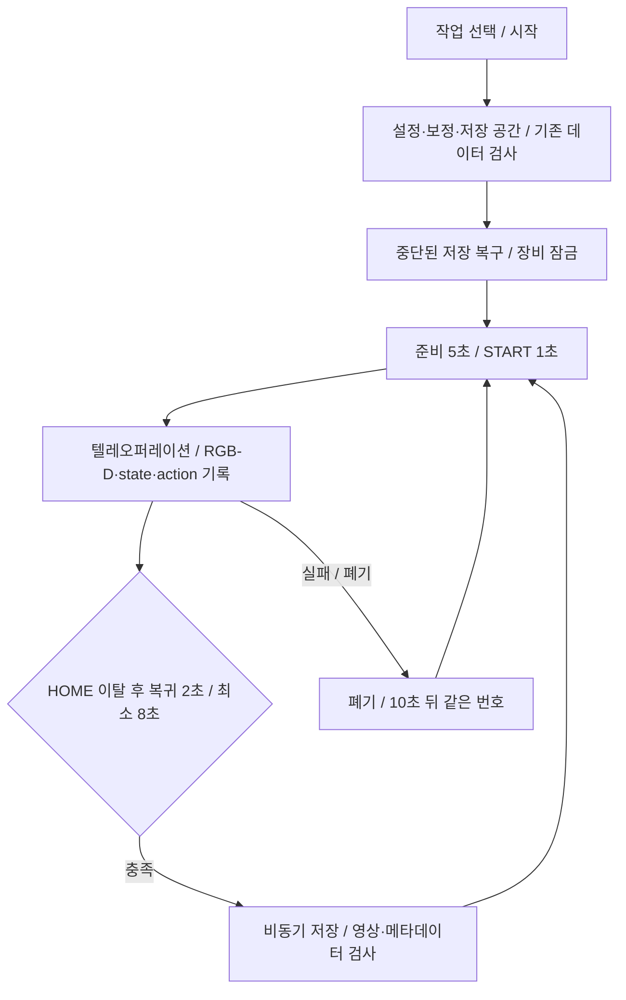

# 수집·학습·실행 pipeline

## 수집 경계

`collect.py`는 UI, worker subprocess와 명령 전달을 맡는다. `core.py`는 `settings.json`을 읽고 기존 `auto_home_record.py`의 장비·인코딩 도우미를 사용한다. GUI를 여는 것과 장비를 연결하는 시점을 분리한다.

작업별 저장 위치는 `robot_datasets/tasks/<task-key>/dataset`이다. task ID 0~5와 key·instruction의 중복을 검사한다. 30 FPS, 640×480, depth 최대 2m는 코드가 검사하는 데이터 규약이다. 설정의 HOME tolerance, 프레임 gap, 유효 FPS 기준도 이어 수집하는 데이터의 일관성과 관련된다.

원자적 JSON 저장은 임시 파일 쓰기, fsync, os.replace를 사용한다. 데이터셋과 장비 잠금, 저장 중단 복구는 동일 장비에서 두 수집기를 겹쳐 실행하지 않기 위한 처리다. 검사 실패 데이터는 새 정상 시연으로 간주하지 않는다.

## 학습 경계

`train_act.py`의 기본 데이터는 `episode_sample_dataset/auto_home_collection/auto_home_dataset`이다. 메타데이터를 policy feature로 바꾸고 `observation.images.top_depth`를 제외한다. `TrainPipelineConfig`와 `ACTConfig`를 구성한 뒤 LeRobot의 `train`을 호출한다.

기본값은 steps 20,000, batch-size 4, save-freq 2,000, 출력 `doll_pickplace_act/outputs/act_100ep_20k`다. 원본 녹화와 모델 파일은 Git에 포함되지 않는다. 학습 설정과 실험 수치를 혼동하지 않도록 [학습 보고서](../notes/doll_pickplace_act_testreport/01_model_training.md)를 따로 둔다.

## 실행 경계

`run_act_pickplace_safe.py`는 기본 `020000` checkpoint의 policy와 processor를 읽는다. `ThreadPoolExecutor`에서 새 관측으로 action chunk를 추론하고, 제어 loop는 기존 chunk를 소비한다. 새 계획 전환 시 팔 관절을 보간하며 그리퍼 닫힘은 별도로 선행시킨다.

`make_safe_action`은 데이터셋 관절 범위, 한 프레임 이동량, 측정 관절 대비 목표의 선행량을 제한한다. state watchdog과 stall monitor를 별도로 둔다. NaN/Inf와 stall을 성공 동작으로 넘기지 않는다.

기본 수집 설정의 30 FPS와 실행기의 기본 30 FPS는 목표 제어 주기다. 실제 성능 측정치나 성공률로 해석하지 않는다. SPACE는 모터 동작 시작, P는 일시정지, Q는 HOME 복귀 종료, E는 즉시 토크 해제다. HOME 복귀 실패 시 사용자가 팔을 받친 뒤 해제하는 경로가 있어 종료 동작을 일괄적인 자동 복귀로 설명할 수 없다.

## 코드 근거

- [수집 engine](../collection/core.py), [GUI](../collection/collect.py), [장비·작업 설정](../collection/settings.json)
- [학습기](../episode_sample_dataset/doll_pickplace_act/train_act.py)
- [실행기](../episode_sample_dataset/doll_pickplace_act/run_act_pickplace_safe.py)
- [초기 수집 도우미](../episode_sample_dataset/auto_home_collection/auto_home_record.py)
