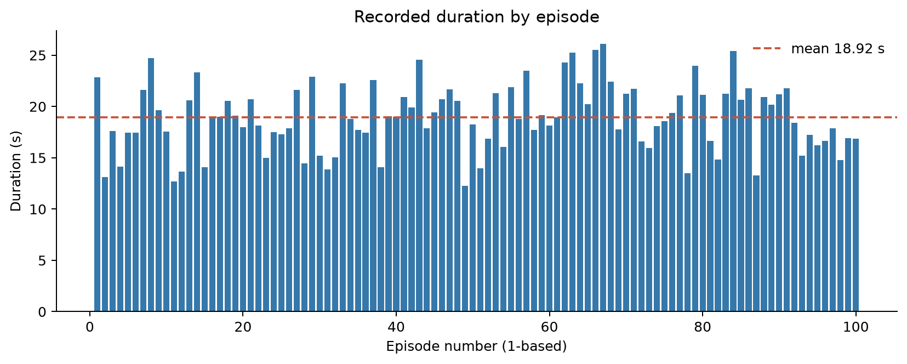
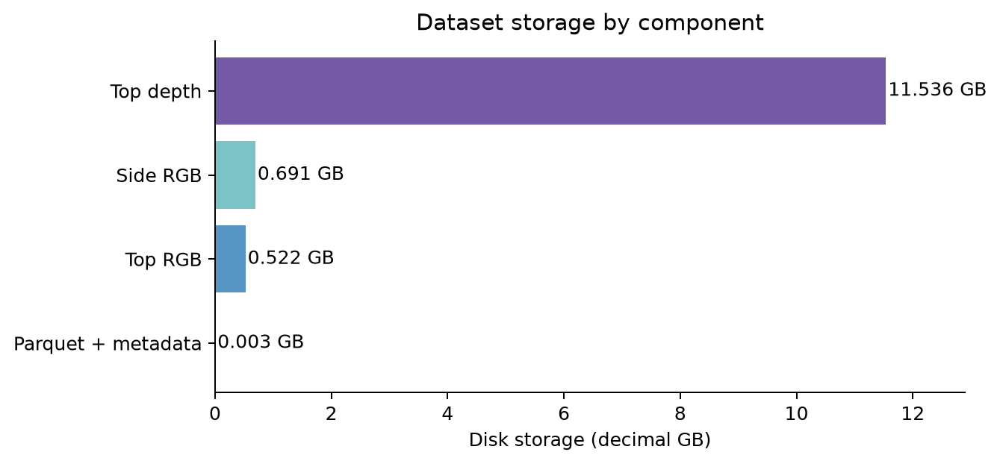

# 01. 모델 학습 방법과 데이터셋 구성

기준: 2026-09-23의 로컬 파일을 읽은 결과. 이 보고서를 작성하면서 학습·실행 코드는 변경하지 않았다. 수치와 그래프의 재생성 방법은 [`build_figures.py`](build_figures.py), 원시 집계는 [`measurements.json`](measurements.json)에 있다.

## 요약

SO-101 인형 픽앤플레이스 ACT는 **LeRobot v3.0 시연 100개, 56,768프레임, 저장 용량 12,750,611,632바이트(12.751 GB = 11.875 GiB)**로 학습했다. 평균 에피소드는 567.68프레임/18.92초이고, 총 기록 시간은 31분 32.27초다. 최종 학습은 **20,000 optimizer step**에 도달했고 최종 체크포인트 `020000`이 있다. 전체 100개를 학습에 사용했으므로 별도 검증 세트는 없다.

## 데이터셋

원본 위치: `D:\lerobot-2026\episode_sample_dataset\auto_home_collection\auto_home_dataset`

| 항목 | 확인한 값 |
|---|---:|
| LeRobot 형식 | v3.0 |
| 에피소드 / 학습 구간 | 100개 / `0:100` 전체 |
| 총 프레임 / 수집 FPS | 56,768 / 30 |
| 에피소드 길이 최소·중앙·평균·최대 | 368·566.5·567.68·783프레임 |
| 에피소드 길이 평균 | 18.92초 |
| 총 기록 시간 | 1,892.27초 = 31분 32.27초 |
| 전체 저장 크기 | 12.751 GB (십진), 11.875 GiB (이진) |
| 비디오 / Parquet data / meta | 12.748 GB / 1.809 MB / 0.696 MB |
| top RGB / side RGB / top depth | 0.522 / 0.691 / 11.536 GB |





깊이 영상은 저장량의 **90.47%**를 차지한다. 따라서 12.751 GB는 *디스크의 원본 데이터셋 크기*이지 ACT가 실제로 입력받는 영상 데이터의 크기가 아니다. 이번 ACT는 `top_depth`를 제외하고 RGB 두 시점과 관절 상태만 입력한다. 비디오 파일 수는 top 85개, side 85개, top depth 98개다. LeRobot가 에피소드를 비디오 파일에 패킹하므로 파일 수가 100과 다르다고 에피소드 누락을 뜻하지 않는다.

```text
auto_home_dataset/
├── meta/info.json                  # 30 FPS, 피처·코덱·총량 정의
├── meta/episodes/chunk-000/*.parquet  # 에피소드 인덱스·길이·비디오 구간
├── data/chunk-000/*.parquet         # 프레임별 state/action/timestamp 등
└── videos/
    ├── observation.images.top/     # 480×640 RGB, H.264
    ├── observation.images.side/    # 480×640 RGB, H.264
    └── observation.images.top_depth/ # 480×640 깊이(mm), HEVC gray12le
```

`observation.state`와 `action`은 각각 다음 순서의 6차원 값이다: `shoulder_pan.pos`, `shoulder_lift.pos`, `elbow_flex.pos`, `wrist_flex.pos`, `wrist_roll.pos`, `gripper.pos`. 카메라 샘플 시각화는 기존 검증 산출물 [`camera_samples.png`](../../episode_sample_dataset/doll_pickplace_act/validation_outputs/camera_samples.png)도 참고할 수 있다.

## 학습 구성

학습 진입점: [`train_act.py`](../../episode_sample_dataset/doll_pickplace_act/train_act.py). LeRobot의 `TrainPipelineConfig`와 `ACTConfig`로 구성한 로컬 학습이다. 2026-09-22 첫 실행은 2,000 step 체크포인트를 저장한 뒤 Windows symlink 권한 문제로 중단됐고, 같은 체크포인트에서 이어서 20,000 step까지 완료했다. 최종 파일의 `training_step.json`은 `step: 20000`을 기록한다.

| 구성 | 실제 값 |
|---|---:|
| 입력 | 6차원 관절 상태 + top/side RGB 각 3×480×640 |
| 출력 | 6차원 절대 관절 목표 × 미래 100프레임 |
| ACT chunk / 관측 스텝 | 100 / 1 |
| 백본 / 모델 폭 | ImageNet 초기화 ResNet-18 / 512 |
| Transformer | encoder 4층, decoder 1층, attention head 8개 |
| VAE | 사용, latent 32, KL 가중치 10 |
| 정규화 | 입력 영상·상태·행동 평균/표준편차 |
| optimizer / LR / weight decay | AdamW / 1e-5 / 1e-4 |
| 배치 / step / 로그 / 저장 간격 | 4 / 20,000 / 20 / 2,000 |
| 계산 | CUDA, AMP, RTX 3080; 작업자 2개 |
| 파라미터 수 | 51,668,614개 (`model.safetensors` shape 합계) |

핵심 피처 선택 코드:

```python
features = dataset_to_policy_features(metadata.features)
output_features = {key: ft for key, ft in features.items()
                   if ft.type is FeatureType.ACTION}
input_features = {key: ft for key, ft in features.items()
                  if key not in output_features and key != DEPTH_KEY}
policy = ACTConfig(input_features=input_features,
                   output_features=output_features,
                   device="cuda", use_amp=True,
                   pretrained_backbone_weights="ResNet18_Weights.IMAGENET1K_V1")
```

20,000 step × 배치 4 = **80,000 샘플 제시**이며, 56,768프레임에 대한 약 **1.41회 노출**에 해당한다. 로그에도 `epch:1.41`이 표시된다. 다만 ACT 한 샘플은 100프레임 미래 행동 창을 학습하므로 단순히 “각 프레임을 1.41회만 학습했다”는 해석은 부정확하다. 시퀀스 창들이 겹친다. 총 학습 데이터 분할은 별도 `val` 없이 모두 train이고, WandB와 학습 중 평가도 비활성화됐다.

## 자료 출처

- 데이터 총량: `auto_home_dataset/meta/info.json`, `meta/episodes/*.parquet`, 폴더별 실제 파일 크기
- 학습 설정: `train_act.py`, 최종 `020000/pretrained_model/config.json`
- 파라미터 수: 최종 `model.safetensors` 텐서 shape 합계
- 학습 완료: `train_resume_stderr.log`의 `End of training`, `020000/training_state/training_step.json`
