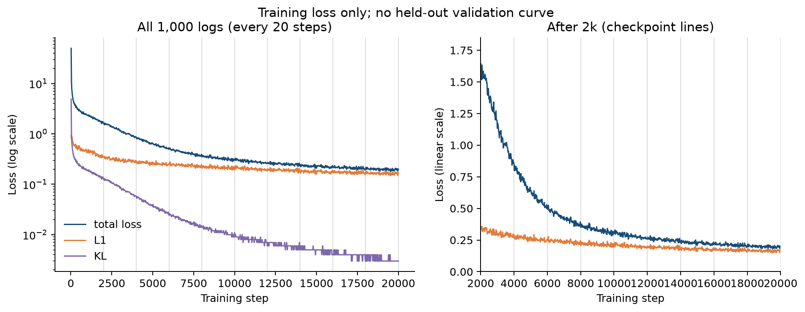
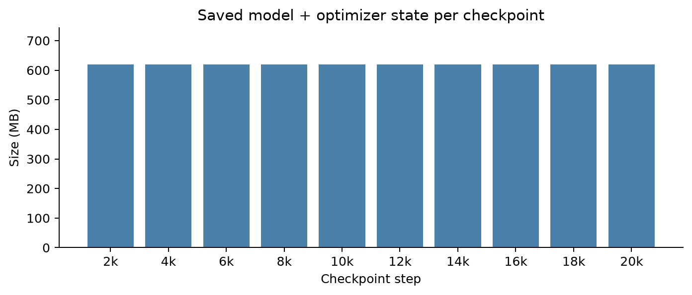
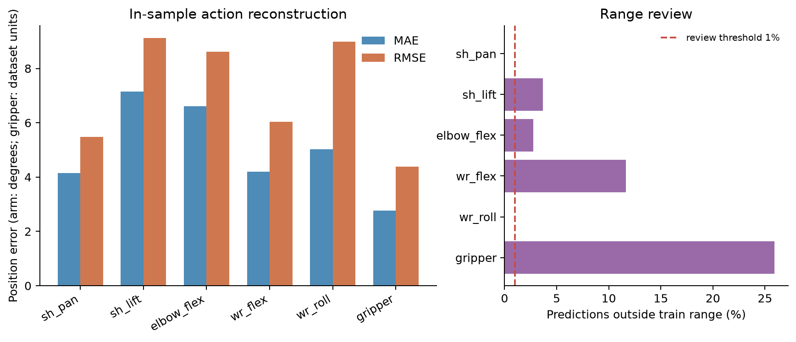
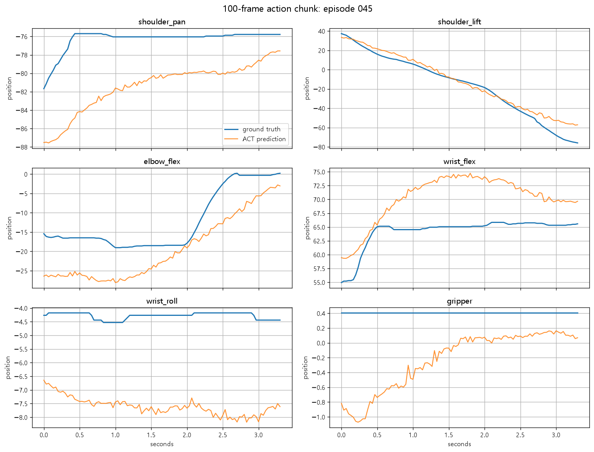

# 02. 학습 곡선·체크포인트·오프라인 평가

이 문서는 [01. 학습 방법](01_model_training.md)의 데이터와 최종 모델을 평가한다. 핵심 결론은 **학습은 정상 완료됐고 시연 행동 재현 오차는 측정됐지만, 미사용 데이터의 일반화 성능이나 실제 픽 성공률은 아직 수치화되지 않았다**는 것이다.

## 학습 곡선

학습 로그에서 **20 step 간격의 손실 1,000개**와 2,000 step 단위 체크포인트를 추출했다. 아래 그래프의 세로선이 체크포인트다. 왼쪽은 초기 큰 손실까지 보이는 로그 눈금, 오른쪽은 2,000 step 이후 확대다. 이것은 **training loss**이지 validation loss가 아니다.



| Step | total loss | L1 | KL |
|---:|---:|---:|---:|
| 2,000 | 1.646 | 0.357 | 0.129 |
| 4,000 | 0.851 | 0.292 | 0.056 |
| 8,000 | 0.351 | 0.212 | 0.014 |
| 12,000 | 0.258 | 0.198 | 0.006 |
| 16,000 | 0.228 | 0.184 | 0.004 |
| 18,000 | 0.197 | 0.163 | 0.003 |
| 20,000 | **0.198** | **0.167** | **0.003** |

2,000→20,000 step total loss는 1.646→0.198로 **87.97% 감소**했다. ACT의 로그 값은 대략 `L1 + 10 × KL` 관계이며, 20,000 step에서 `0.167 + 10×0.003 ≈ 0.197`로 반올림된 total loss 0.198과 맞는다. 마지막 18,000→20,000 step에서는 오히려 0.197→0.198로 거의 정체다. 마지막 체크포인트가 미사용 데이터에서 최선인지는 검증 곡선이 없어 판단할 수 없다.

## 체크포인트 무결성

`002000`부터 `020000`까지 2,000 step 간격 **10개**를 확인했다. 최종 `020000`에는 정책 가중치, 전처리·후처리 통계, 학습 설정, optimizer 상태, RNG 상태와 `training_step.json`이 있다. 각 체크포인트는 약 619.564 MB(십진)이고 10개 전체가 약 6.196 GB다. 최종 정책 가중치만 약 206.7 MB, optimizer 상태가 약 412.8 MB다.



최종 경로: `D:\lerobot-2026\episode_sample_dataset\doll_pickplace_act\outputs\act_100ep_20k\checkpoints\020000\pretrained_model`

재개 학습 설정에 남은 `pretrained_path`는 시작점인 `002000`을 가리킨다. **최종 모델이 2,000 step이라는 뜻이 아니다.** `020000` 폴더명, `training_step.json`의 `step: 20000`, 로그의 완료 기록을 함께 기준으로 삼아야 한다.

## 오프라인 행동 예측

기존 [`validate_act_model.ipynb`](../../episode_sample_dataset/doll_pickplace_act/validate_act_model.ipynb)의 검증 결과를 재집계했다. 100개 중 균등 간격으로 선택한 **12개 에피소드**의 약 35% 지점에서 각각 100프레임 미래 행동을 예측해, 총 **1,200개 프레임 × 6관절**을 정답 행동과 비교한 학습 데이터 내 재현 검사다. 모두 학습에 들어간 에피소드이며, 특정 하나의 시작 프레임만 사용했다. 독립 테스트나 성공률 측정이 아니다.

| 관절 | MAE | RMSE | 학습 범위 밖 예측 |
|---|---:|---:|---:|
| shoulder_pan | 4.144 | 5.488 | 0.00% |
| shoulder_lift | 7.150 | 9.124 | 3.67% |
| elbow_flex | 6.603 | 8.612 | 2.75% |
| wrist_flex | 4.201 | 6.035 | 11.67% |
| wrist_roll | 5.026 | 8.992 | 0.00% |
| gripper | 2.761 | 4.384 | **25.92%** |



한 시작점(에피소드 45, 100프레임)의 정답 행동과 예측 행동을 겹쳐 보면 팔 이동의 큰 방향은 따라가지만 관절별 시간·위치 편차가 남는다. 이는 대표성 있는 성공률 샘플이 아니라 **단일 학습 에피소드의 재현 예시**다.



6차원 평균 MAE는 **4.981**, 관절별 학습 범위로 정규화한 평균 MAE는 **3.518%**, 전체 예측 좌표의 학습 범위 이탈률은 **7.333%**다. 팔 5관절 오차의 단위는 도(°), 그리퍼 오차는 데이터셋의 0–100 스케일 단위이므로 4.981은 서로 다른 단위의 단순 평균이지 물리적인 각도 오차가 아니다. 기존 검증 결과의 verdict가 `REVIEW`인 직접 이유는 `prediction_range_sane=false`다. 특히 gripper 25.92%, wrist_flex 11.67%가 두드러진다. 이 비율은 **오프라인 원시 예측값** 기준이고, 실제 실행에서는 학습된 min/max로 명령을 clip한다. Clip은 안전 범위에는 도움이 되지만 원하는 파징 타이밍·접촉력을 보장하지 않는다.

검증 노트북의 핵심 계산:

```python
eval_eps = np.linspace(0, dataset.num_episodes - 1, 12, dtype=int)
predicted = postprocess(policy.predict_action_chunk(batch))[0]
err = predicted[valid] - target[valid]
all_abs = np.concatenate([r['abs_err'] for r in results])
joint_mae = all_abs.mean(axis=0)
outside = (all_pred < action_min) | (all_pred > action_max)
```

## 무엇을 아직 평가하지 못했나

- 미사용 배치·다른 물체 위치·조명에 대한 held-out loss/MAE가 없다.
- 공개된 실습 영상은 성공 사례 2개만 있어, 시도 횟수 대비 **첫 시도 픽 성공률**은 계산할 수 없다.
- 실행 프레임별 `정책 원시값 → clip/속도제한 후 송신값 → 측정 관절값 → 접촉/물체 이동`의 동기화 로그가 없다. 따라서 관절 지연·그리퍼 힘·영상상 상승 시작의 정확한 시간차를 계량할 수 없다.
- 관절 MAE가 작더라도 손끝의 수 cm 정렬 오차나 접촉 직후 미끄러짐은 별도로 발생할 수 있다.

평가 결과의 실제 신호는 “모델 파일이 완성됐고 행동 형태는 학습 데이터 내에서 대체로 재현되지만, wrist/gripper 범위 이탈과 파징 타이밍 문제를 남긴다”이다. 다음 수정 판단에는 실습 시계열 계측과 미사용 평가 세트가 필요하다. 현재 실행 코드의 행동 분석은 [03. 모델 실습](03_execution_analysis.md)에 정리했다.
