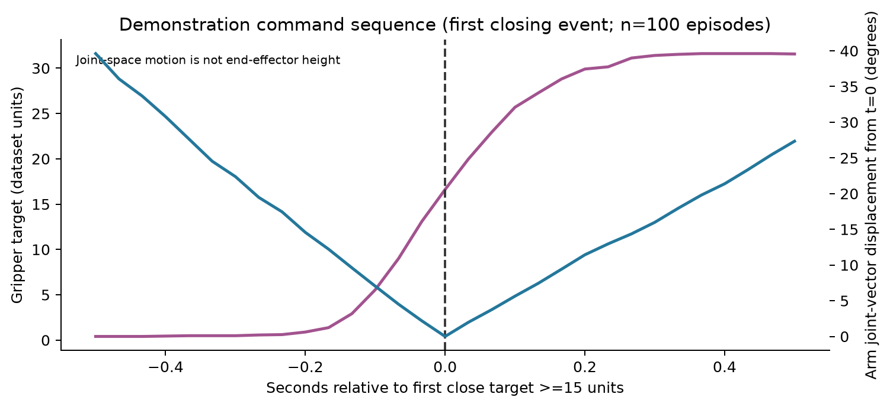
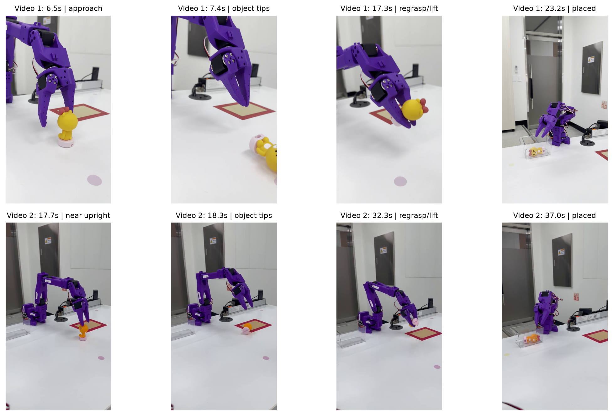

# 03. 실습 구조·행동 패턴·파징 시점 원인 분석

기준 실행 파일: [`run_act_pickplace_safe.py`](../../episode_sample_dataset/doll_pickplace_act/run_act_pickplace_safe.py) (2026-09-23 현재). **분석만 수행했고 실행·학습 코드는 수정하지 않았다.** 아래에서 “확인”은 파일·데이터·영상으로 직접 확인한 사실, “가능성”은 추가 계측 없이는 판정할 수 없는 설명이다.

## 현재 실행 구조와 시간 단위

top/side RGB와 6관절 측정 상태를 받아 ACT가 **100×6 미래 관절 목표**를 한 번에 예측한다. 별도 객체 검출기나 픽 지점 좌표 추정기는 없다. 30 FPS 제어 루프에서 행동 chunk를 실행하고 비동기 추론으로 60프레임마다 새 chunk를 요청한다. 새 계획이 도착하면 팔 행동의 첫 8프레임을 앞 계획과 혼합한다. 그리퍼 닫기 목표는 8프레임 뒤 예측을 앞당겨 사용하며, 계획 전환 중 새 닫기 목표는 혼합 지연을 받지 않도록 한다. 그 뒤 학습 행동 범위 제한·프레임당 변화량 제한·현재 관절값 대비 추종 제한을 거쳐 6관절 목표를 함께 송신한다.

| 단위/설정 | 현재 값 | 30 FPS 기준 |
|---|---:|---:|
| 관측 스텝 | 1프레임 | 현재 시점 영상+상태 |
| ACT 출력 chunk | 100프레임 × 6관절 | 3.333초 예측 |
| 재계획 주기 | 60프레임 | 명목상 2.000초마다 |
| 팔 계획 전환 혼합 | 8프레임 | 0.267초 |
| 그리퍼 닫기 선행 | 8프레임 | 0.267초 |
| 기본 최대 실행 시간 | 60초 | 최대 명목상 1,800 제어 프레임 |
| 조작 범위 | 시연 데이터의 관절 min/max | 전 프레임 clip |

30 FPS는 *설정값*이다. 실제 카메라/추론/직렬 통신을 포함한 실시간 유지율은 프레임별 타임스탬프 로그가 없어 측정하지 못했다. 재계획도 추론 결과 도착 시점에 교체되므로 정확히 매 2초에 동작이 바뀐다는 뜻은 아니다. `--fps 60` 같은 값을 임의로 높여도 모델이 60 FPS 데이터로 학습된 것은 아니며, 실제 하드웨어 60 Hz 달성도 보장되지 않는다.

실행 코드의 핵심 스니펫:

```python
# 현재 관측에서 100×6 행동 chunk를 예측
chunk = policy.predict_action_chunk(batch)

# 팔 계획은 8프레임 crossfade, 그리퍼 닫기는 새 목표를 즉시 우선
switched[:blend_frames] = (1.0 - alpha) * old_remaining[:blend_frames] \
                        + alpha * switched[:blend_frames]
switched[:blend_frames, 5] = np.maximum(
    switched[:blend_frames, 5], new_aligned[:blend_frames, 5]
)

# 그리퍼 닫기만 8프레임 앞당김; 팔 동작은 그대로
action = plan[index].copy()
action[5] = max(float(action[5]), float(plan[min(index + lead_frames, len(plan)-1), 5]))
safe_action, flags = make_safe_action(action, observation, ...)
robot.send_action(safe_action)  # 6관절 목표를 같은 제어 프레임에 송신
```

위 코드는 실제 `predict_chunk`, `switch_action_plans`, `action_with_early_gripper_close`, `run_episode`의 핵심 흐름을 압축한 것이다. 생략 표시 `...`는 문서용으로만 썼으며 실행 가능한 패치가 아니다.

## 시연 데이터의 파징 전후 행동

100개 에피소드의 `action`에서 그리퍼 목표가 처음 **15 데이터 단위** 이상이 되는 순간(그 전 15프레임 내 5 단위 미만 상태가 있는 경우)을 기준점으로 잡았다. 100개 모두 해당 이벤트가 있었다. 이벤트 이후 10프레임(0.333초)의 **팔 5관절 목표 벡터** 변화량 중앙값은 **17.94°**, 5°를 넘는 에피소드는 **88/100개(88%)**다. 즉 시연 행동 명령 자체가 그리퍼를 닫는 동안 팔 관절 목표를 계속 바꾸는 사례가 많다. 팔은 각도, 그리퍼는 데이터셋의 0–100 스케일을 쓴다. 17.94°는 팔의 관절 공간 벡터 거리이지 손끝 상승 높이나 “물체를 든” 성공률은 아니다.



정렬 규칙과 계산의 핵심:

```python
onset = np.flatnonzero((gripper_target[1:] >= 15)
                     & (gripper_target[:-1] < 15))[0] + 1
arm_change_10f = np.linalg.norm(action[onset+10, :5]
                                - action[onset, :5])
```

## 실습 영상에서 관찰한 행동 예시

아래는 사용자가 제공한 두 **성공 영상**의 대략적인 장면 시각이다. 영상 시작점을 0초로 읽은 시각이며, 코드 내부 프레임 번호와 동기화된 값은 아니다. 두 영상이 현재의 `gripper-close-lead=8` 버전으로 찍혔는지도 실행 로그가 없어서 확정할 수 없다.

| 영상 | 첫 접근 및 문제 장면 | 회복 이후 | 결과 |
|---|---|---|---|
| `KakaoTalk_성공 1.mp4` | 약 6.5초 손가락이 선 인형에 접근; 약 7.4초 인형이 넘어짐 | 약 17.3초 누운 인형을 다시 잡고 들어 올림 | 약 23.2초 투명 상자에 넣음 |
| `KakaoTalk_20260923_성공2.mp4` | 약 17.7초 선 인형에 근접; 약 18.3초 넘어짐 | 약 32.3초 누운 인형을 다시 잡고 들어 올림 | 약 37.0초 투명 상자에 넣음 |



이 두 영상은 “선 인형 첫 접근 → 안정적으로 정지·파징 → 상승”의 성공 사례라기보다 **첫 접근 중 넘어뜨린 뒤 재시도로 회복한 사례**다. 성공 사례만 제공됐으므로 `2/2=100% 성공률`처럼 계산하면 선택 편향이다. 전체 시도 수, 첫 시도 성공률, 파징 실패율은 현재 자료로 산출할 수 없다.

## “올라가면서 파징” 원인 판단

### 확인된 구조적 원인

1. 실행 코드는 손을 물체 위치에서 **정지시키고, 닫기 완료를 확인한 뒤, 상승하는 단계 제어를 갖고 있지 않다.** ACT가 예측한 팔 5관절 목표와 gripper 목표를 같은 제어 프레임에 계속 보낸다.
2. 그리퍼 닫기 목표를 8프레임(0.267초) 앞당기지만, 팔의 상승·이탈 동작을 붙잡아 두지는 않는다. 닫기 *명령 시점*만 바뀌며 실제 손가락이 물체를 잡았는지 확인하지 않는다.
3. 시연 `action` 통계에서도 닫기 시작 직후 팔 목표 변화가 빈번하다(10프레임 내 중앙값 17.94°, 88%가 5° 초과). 따라서 모델이 “닫는 동안 팔도 움직이는” 연속 동작을 재현하는 것은 데이터 구성과도 일치한다.

따라서 사용자가 본 **상승과 파징의 시간 중첩은 현재 코드만으로도 발생 가능한 구조**다. “반드시 멈춰서 파징하고 그 뒤에 올라가게 한다”는 보장은 현재 구현에 없다. 이것이 가장 확실한 결론이다.

### 아직 단정할 수 없는 부분

- 영상 속 실제 상승이 **정책의 팔 목표에서 먼저 시작됐는지**, 계획 교체·그리퍼 선행·범위 clip 뒤의 최종 명령 때문인지, 모터 추종 지연 때문에 닫힘이 늦게 보이는지 분리할 동기화 기록이 없다.
- “물체를 온전히 잡기 전 상승”의 정확한 지연 시간이나 접촉력은 영상만으로 측정할 수 없다. 손가락 전류/힘·접촉 상태가 데이터/실행 판단에 포함되지 않는다.
- 2개 영상은 현재 코드 리비전과 매칭되지 않아, `lead=8` 변경의 효과를 이 영상만으로 평가할 수 없다.
- 깊이 영상은 저장됐지만 학습·실행 모델 입력에서 빠져 있다. 깊이를 넣으면 잡는다는 결론도 현재 자료로는 낼 수 없다.
- 명목상 30 FPS에서 실측 프레임 유지율과 지연 분포를 측정하지 않아, 과거 30/60 설정의 체감 차이를 정량적으로 귀속시킬 수 없다.

## 수정 전 확인하면 좋은 계측

코드 수정 판단을 위해서는 한 번의 안전한 시험에서 같은 타임스탬프로 `관측 시각`, `새 chunk 생성/전환`, `6관절 원시 예측`, `최종 송신 목표`, `실측 관절`, `gripper 닫힘`, `물체 접촉/이동`, `카메라 프레임`을 묶어야 한다. 그러면 “모델이 상승을 먼저 예측했는가 / 제한기가 닫힘을 늦췄는가 / 모터가 추종하지 못했는가”를 각각 검증할 수 있다. 이 보고서는 그 결론을 앞질러 임의의 정지 시간이나 파징 상태기계를 코드에 넣지 않았다.
